# AdML_A3

### 问题陈述

任务：Autoencoder (20 points)

使用自动编码器学习输入的特征表示。尝试设计一个全链接前馈神经网络或卷积神经网络。尝试使用不同的损失函数和正则化方法。


附加题： (BONUS: 10 points)

模型训练中，你可以尝试任何可以提升模型性能的合理的方法。例如其它的网络结构、设计多个隐藏层、引入降噪自动编码器等任何你能想到的方法。计算模型在训练集和测试集上的损失，并对结果进行讨论。 


### 实验过程

设计编码器部分，如下：

```
self.encoder = nn.Sequential(
    nn.Linear(28 * 28, 256),
    nn.Tanh(),
    nn.Linear(256, 128),
    nn.Tanh(),
    nn.Linear(128, 64),
    nn.Tanh(),
    nn.Linear(64, 12),
    nn.Tanh(),
    nn.Linear(12, 3)
)
```

与编码部分相对应，解码器设计如下：

```
self.decoder = nn.Sequential(
 	nn.Linear(3, 12),
    nn.Tanh(),
    nn.Linear(12, 64),
    nn.Tanh(),
    nn.Linear(64, 128),
    nn.Tanh(),
    nn.Linear(128, 256),
    nn.Tanh(),
    nn.Linear(256, 28 * 28),
    nn.Sigmoid()
)
```

本次实验使用MNIST数据集，分别使用MSE、L1、SmoothL1三种损失函数进行训练。
##### MSE

损失曲线图如下：
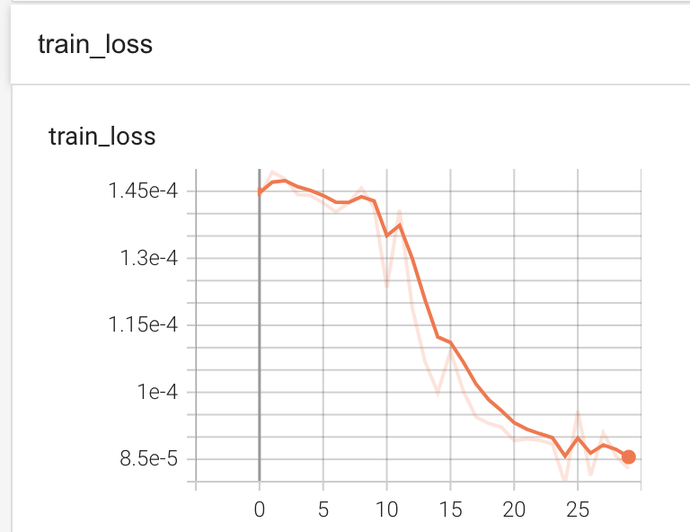

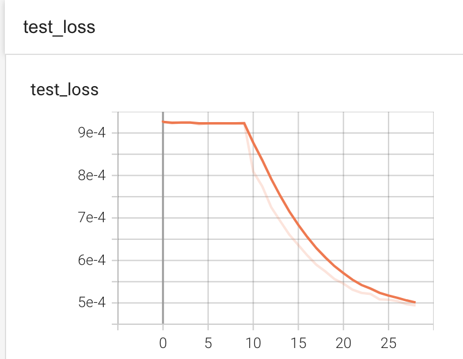

##### L1

损失曲线图如下：
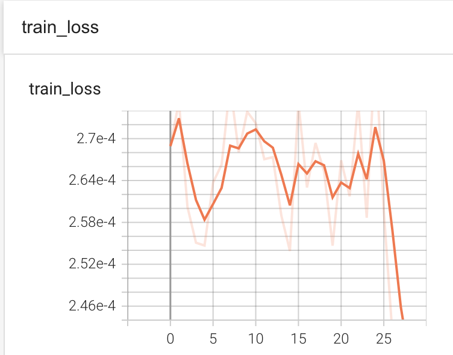

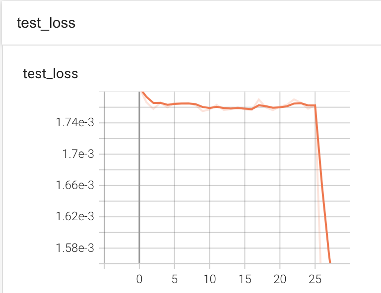

##### SmoothL1

损失曲线图如下：
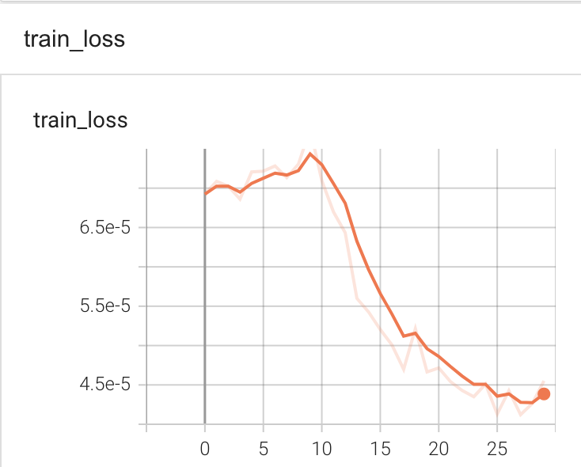

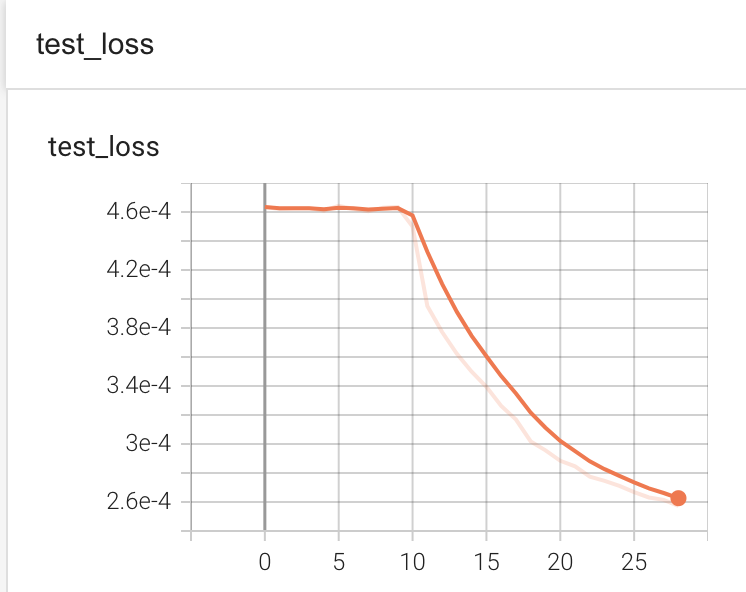


##### 不同损失函数的3D图像

 - MSE
   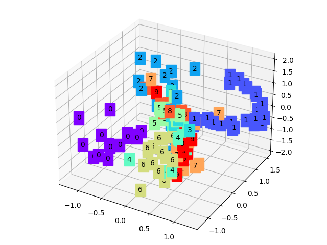
 - L1
   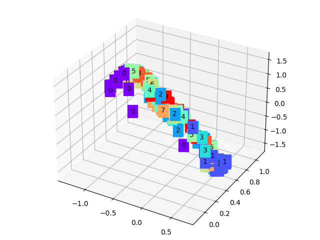
 - SmoothL1
   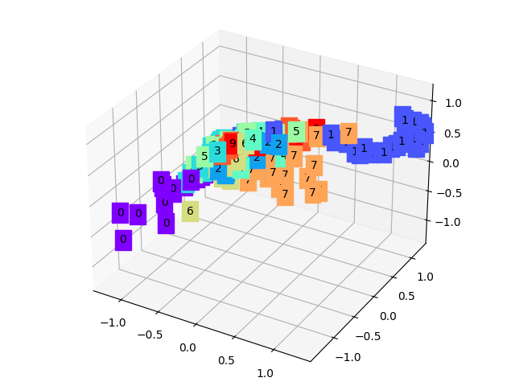

可以看到，无论是L1还是SmoothL1均只能较好地区分0和1，对于其他的数字效果远比MSE差。


##### 不同损失函数的还原结果

   - MSE
      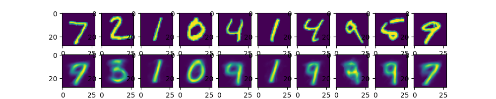
   - L1
      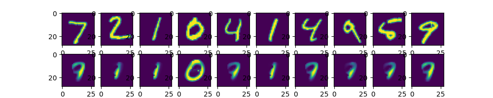
   - SmoothL1
      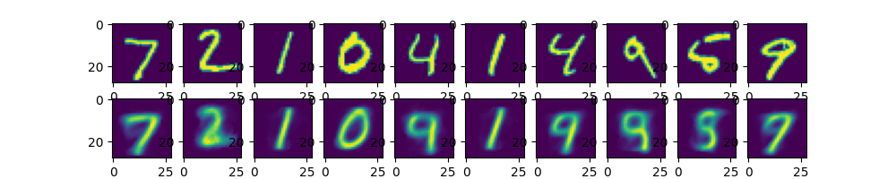

显然，MSE的还原效果最好。因此，在这个模型上，选用MSE作为损失函数，效果最佳。

### 基于CNN的自编码器

本部分实验改用了基于CNN的自编码器（即AutoencoderCNN）

编码器设计如下：

```
self.encoder = nn.Sequential(
            nn.Conv2d(1, 8, 3, stride=2, padding=1),
            nn.ReLU(True),
            nn.Conv2d(8, 16, 3, stride=2, padding=1),
            nn.BatchNorm2d(16),
            nn.ReLU(True),
            nn.Conv2d(16, 32, 3, stride=2, padding=0),
            nn.ReLU(True),
            nn.Flatten(start_dim=1),
            nn.Linear(3 * 3 * 32, 128),
            nn.ReLU(True),
            nn.Linear(128, 4)
        )
```

解码器设计如下：

```
self.decoder = nn.Sequential(
            nn.Linear(4, 128),
            nn.ReLU(True),
            nn.Linear(128, 3 * 3 * 32),
            nn.ReLU(True),
            nn.Unflatten(dim=1, unflattened_size=(32, 3, 3)),
            nn.ConvTranspose2d(32, 16, 3, stride=2, output_padding=0),
            nn.BatchNorm2d(16),
            nn.ReLU(True),
            nn.ConvTranspose2d(16, 8, 3, stride=2, padding=1, output_padding=1),
            nn.BatchNorm2d(8),
            nn.ReLU(True),
            nn.ConvTranspose2d(8, 1, 3, stride=2, padding=1, output_padding=1)
        )
```

##### 损失曲线图如下：

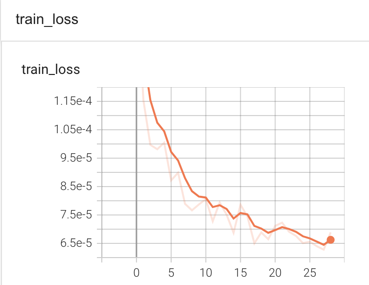

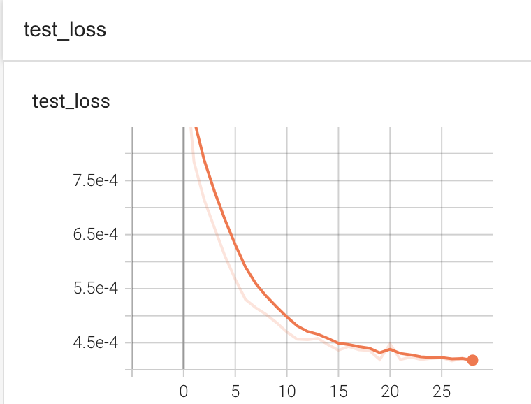


##### CNN还原的3D图像

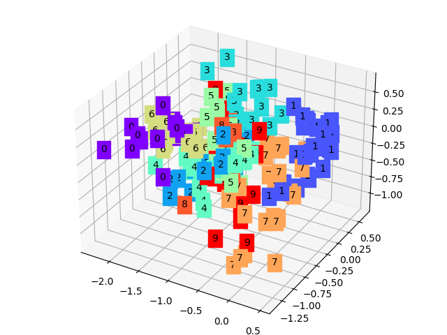

##### CNN的还原结果

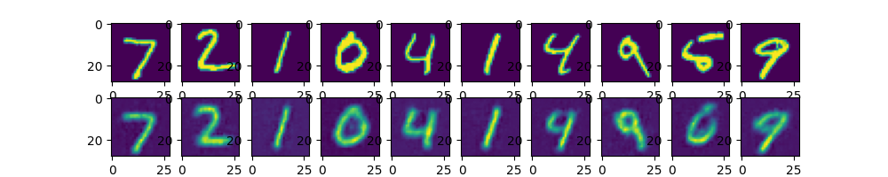

由以上数据可以明显看出，CNN的特征提取和还原能力要强于全链接前馈神经网络。